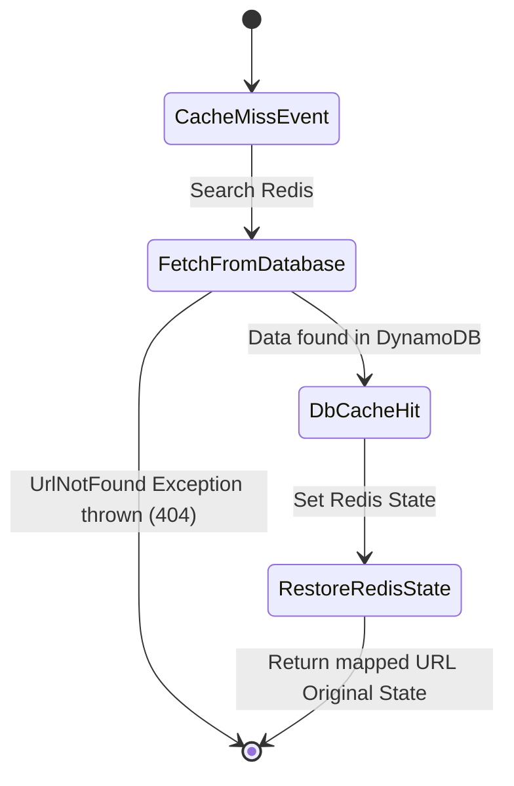

# Low-Level Design (LLD)

## 1. System Modules (Spring Boot)

The URL Shortener backend is segregated into clean, explicit RESTful packages adhering strictly to standard Single-Responsibility principles.

### Controller Layer
- `UrlController`: Intercepts client ingress representing the primary endpoints `POST /api/v1/urls` (shorten), `GET /api/v1/urls/{code}` (stats check), `DELETE /...`, and `GET /{code}` (immediate redirect).

### Service Layer
- `UrlShortenerService`: Coordinates core logic.
  - Generates Base62 hashes leveraging the `Base62Encoder` utility.
  - Queries `RedisTemplate` dynamically before falling back to `UrlRepository` fetching. 
  - Offloads standard runtime statistics creation down to `AnalyticsService`.
- `AnalyticsService`: Houses the explicit function references interacting cleanly with Spring Cloud AWS's `@SqsTemplate` to offload `ClickEvent` telemetry objects securely into SQS Queues.
- `ClickEventListener`: Independently listens continuously via `@SqsListener` bindings onto the SQS endpoint mapped into Terraform. 

### Data Access Layer
- `UrlRepository`: Explicit repository orchestrating `DynamoDbEnhancedClient` calls towards the `url_mappings` table, enforcing mapping operations directly toward AWS SDK V2 protocols.

---

## 2. Core Logic Diagrams & Algorithms

### Base62 Code Generation
Rather than sequential SQL-style UUID rows, the application generates a concise identifier iteratively:
1. Extract `UUID.randomUUID()` components natively.
2. Condense bytes down into safe string ranges spanning exactly 62 character groups `[A-Za-z0-9]`.
3. Check `DynamoDB` cache availability implicitly via index guarantees to prevent collisions across distributed deployments.

### Caching Strategy & Object Lifecycles

---

## 3. Data Models

### 3.1 Entity Representation: `UrlMapping` (Stored in DynamoDB)
Represents the source of truth for all links generated dynamically.

| Attribute        | Type         | Comments                         |
|------------------|--------------|----------------------------------|
| `code`           | String (PK)  | Primary Key. Base62 value limit  |
| `originalUrl`    | String       | The actual user target link      |
| `createdAt`      | ISO-8601 UTC | Timestamp marking creation run   |
| `expiresAt`      | ISO-8601 UTC | Timestamp calculated TTL marker  |
| `clickCount`     | Integer      | Analytic aggregation count field |

### 3.2 DTOs (Data Transfer Objects)

#### `ShortenRequest`
| Field         | Validation    | Reason                                         |
|---------------|---------------|------------------------------------------------|
| `originalUrl` | Not Blank, URL| Must represent valid routable targets for HTTP |
| `customCode`  | Regex, Nullbl | Allowed exclusively between 4 and 10 char limit|

#### `ClickEvent` (Pushed onto Amazon SQS)
| Field       | Type              | Reason                                         |
|-------------|-------------------|------------------------------------------------|
| `code`      | String            | Identity tracking to merge metrics back safely |
| `userAgent` | String            | Analytics extraction metric capturing metrics  |
| `ipAddress` | String            | Analytics extraction metric capturing ranges   |
| `referer`   | String            | Ingress analytics reference tracking metric    |
| `timestamp` | ISO-8601 UTC      | Processing tracking mapping field explicitly   |

---

## 4. Exception Handling

Centralized under `@RestControllerAdvice` within `GlobalExceptionHandler.java`:
- `CodeAlreadyExistsException`: Responds `409 Conflict`.
- `UrlNotFoundException`: Responds `404 Not Found`.
- `MethodArgumentNotValidException`: Responds `400 Bad Request` outlining violation syntax properties directly dynamically via `ErrorResponse` objects.
- `Internal Server Exceptions`: Propagates safe un-described `500` syntax to clients avoiding stacktrace leaks securely.
