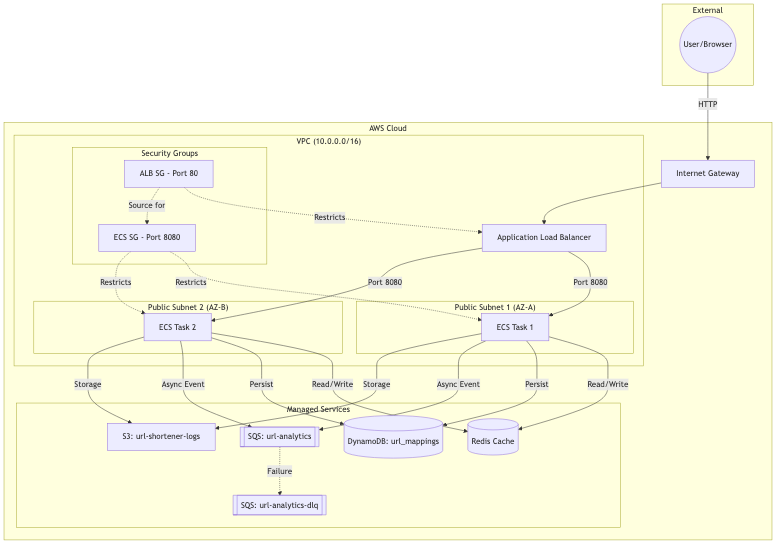

# Infrastructure as Code (Terraform) - Educational Guide

This directory contains the **Terraform** configuration used to provision the AWS resources for the URL Shortener service. Terraform is an Infrastructure as Code (IaC) tool that allows you to define your infrastructure in a declarative configuration language (HCL - HashiCorp Configuration Language).

## 1. Core Terraform Concepts

*   **Providers**: Plugins that allow Terraform to interact with cloud providers (like AWS). In this project, we use the `aws` provider, but configured to point to **LocalStack** for local development.
*   **Resources**: The "things" you want to create (e.g., a DynamoDB table, an S3 bucket, a VPC).
*   **Modules**: Containers for multiple resources that are used together. They allow for better organization and reusability.
*   **Variables**: Input parameters that allow you to customize the configuration without changing the code.
*   **Outputs**: Values returned by a module or the root configuration (e.g., the URL of an SQS queue).
*   **State**: Terraform keeps track of the resources it manages in a `terraform.tfstate` file. This is how it knows what to update or delete when you change your code.

## 2. Infrastructure Visualization



## 3. Project Structure

```text
infra/
├── main.tf          # The "root" module that orchestrates everything by calling sub-modules.
├── provider.tf      # Configures the AWS provider and LocalStack endpoint overrides.
├── variables.tf     # Defines input variables for the root module.
├── outputs.tf       # Defines output values for the root module.
├── terraform.tfvars # Provides values for the variables (region, environment names, etc.).
└── modules/         # Individual components encapsulated as reusable modules.
    ├── vpc/         # Networking layer (VPC, Subnets, Internet Gateway, Routing).
    ├── alb/         # Load Balancing (Application Load Balancer, Target Groups, Listeners).
    ├── ecs/         # Compute layer (ECS Cluster, Fargate Services, Task Definitions, IAM).
    ├── dynamodb/    # Persistent Storage (url_mappings table).
    ├── sqs/         # Messaging/Analytics (url-analytics queue + DLQ).
    └── s3/          # File Storage (url-shortener-logs bucket).
```

## 3. How the Pieces Fit Together

1.  **Networking (`vpc`)**: We start by creating a virtual private network. We divide it into multiple **Subnets** across different **Availability Zones** (AZs) for high availability. We add an **Internet Gateway** so that our Load Balancer can be reached from the internet.
2.  **Security**: We use **Security Groups** as virtual firewalls. The ALB has a group allowing port 80 (HTTP). The ECS tasks have a group allowing traffic *only* from the ALB on port 8080.
3.  **Data Stores (`dynamodb`, `sqs`, `s3`)**: We provision the managed services. These are accessible by the application using IAM roles.
4.  **Load Balancing (`alb`)**: The ALB receives external traffic and distributes it across the ECS instances. It performs **Health Checks** to ensure it only sends traffic to healthy containers.
5.  **Compute (`ecs`)**: We use **AWS Fargate**, which is a serverless compute engine for containers.
    *   **Task Definition**: Describes *what* to run (Docker image, CPU, Memory, Env vars).
    *   **Service**: Describes *how many* to run and ensures they are kept alive.
    *   **IAM Roles**: The `execution_role` allows ECS to pull images and push logs. The `task_role` gives your Java code permission to talk to DynamoDB and SQS.
6.  **Scaling (`ecs`)**: We use **target tracking** auto-scaling. If the average CPU usage of all containers goes above 70%, AWS automatically spins up more containers (up to 10). If usage drops, it removes them (down to 2).

## 4. Key Takeaways for Learning

*   **Declarative vs Imperative**: You don't tell Terraform *how* to build it (step 1, step 2); you tell it *what* the final state should look like, and Terraform figures out the plan.
*   **Dependencies**: Terraform automatically understands the order of operations. For example, it knows it can't create an ALB until the VPC subnets exist.
*   **Modularity**: By using modules, we keep the code clean. If you want to change how the database is configured, you only need to look at `modules/dynamodb`.
